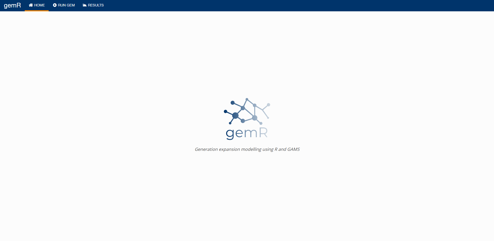
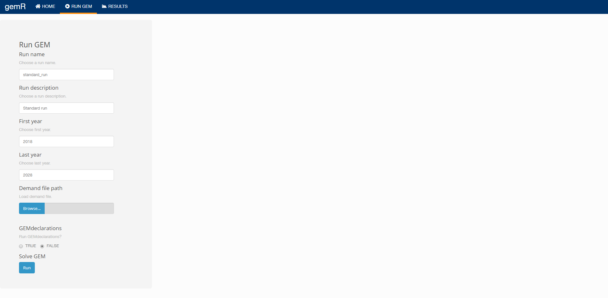
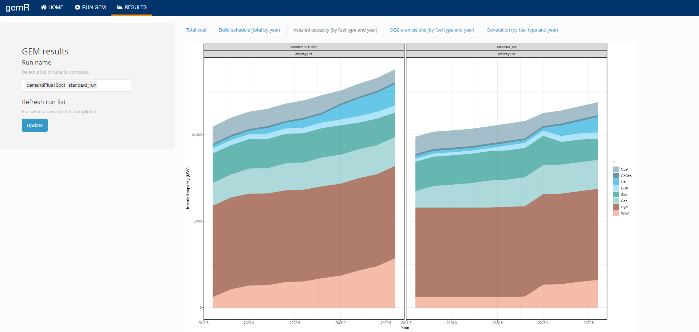

# gemR
Integration of GEM with R

## App screenshots

***

***

***

## Some instructions

- When using R in this project always open the **.Rproj** file as this is what all filepaths are relative to.

