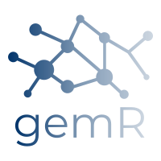

***Integration of GEM with R***

## Software requirements

- [R](https://cran.r-project.org/bin/windows/base/) - current project version: 3.5.1
- [RStudio](https://www.rstudio.com/products/rstudio/download/)
- [GAMS](https://www.gams.com/download/) - current project version: 25.1.3
- [git](https://git-scm.com/downloads) - this is more of a nice-to-have as you can still download the project as a zip file from GitHub.

***

## Installation

1. Open a command prompt (or git bash) and navigate to the path you would like to clone the project repository to (e.g. `cd C:\apps\`).
2. Use **git** to clone the repository by typing the following: `git clone https://github.com/ElectricityAuthority/gemR.git`. This will create a copy of the `gemR` project in the location you navigated to in step 1.
3. Navigate to the `gemR` folder and open the project in **RStudio** (double-click on `gemR.Rproj`).
4. On loading the project for the first time, there is a check to see if the `packrat` package is installed (`packrat` is being used for package management and reproducibility). If it does not exist, **RStudio** will attempt to install it. (**NOTE**: if you have cloned the project to a mapped network drive you may see the error: ***cannot set reparse point '...gemR/packrat/lib-R/x86_64-w64-mingw32/3.5.1/base', reason 'Access is denied***. It is a known issue, just ignore it.)
5. Restore all packages required by the project using a call to `packrat::restore()`. **This will take a while but will only need to be done once - go grab a coffee!**.
6. Restart your **RStudio** session (`Session` > `Restart R`) - **an important step!**

***

## To run via the shiny app

1. Use the `Files` tab in RStudio to navigate to `Programs/R/gemR_shiny/`.
2. Open `ui.R` and click the `Run App` button at the top right of the script.
3. In the `Run GEM` tab, choose a run name, start and end dates and a demand file and click `Run`. 
4. After the run has finished solving, explore the output in the `Results` tab.

***

## To run via R script

1. Use the `Files` tab in RStudio to navigate to `Programs/R/runGEM/`. 
2. Open `runGEM.R`.
3. Update the parameter objects (run name, dates, etc.) at the top of the script.
4. Step through and run each subsequent section in sequence.
5. Plots are output to `Output/<run name>/Reports/plots/`.

***

## Creating a demand file
[To come]

***

## Modifying input files
[To come]

***

## App screenshots

***

***

***
